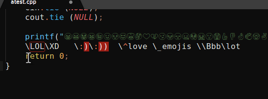

UnicodeMath
===========

  [![PayPal][paypal-donate-image]][paypal-donate-link] [![Flattr this git repo][flattr-donate-image]][flattr-donate-link]

[paypal-donate-image]: https://www.paypalobjects.com/en_US/i/btn/btn_donate_SM.gif
[paypal-donate-link]: https://www.paypal.com/cgi-bin/webscr?cmd=_donations&business=voidex%40live%2ecom&lc=US&no_note=0&currency_code=USD&bn=PP%2dDonationsBF%3abtn_donate_SM%2egif%3aNonHostedGuest
[flattr-donate-image]: http://api.flattr.com/button/flattr-badge-large.png
[flattr-donate-link]: https://flattr.com/submit/auto?user_id=voidex&url=https://github.com/UnicodeMath/UnicodeMath&title=UnicodeMath&language=&tags=github&category=software

Plugin for Sublime for inserting unicode math symbols

Installation
---

Install via [PackageControl](https://packagecontrol.io) or `git clone` in your Packages directory (Select `Preferences → Browse Packages...` to open right packages directory).

Usage
-----

Input backslash and name of unicode symbol (for example `\forall`) then insert space and text will be automatically converted to ∀ 
To insert space use `shift+space`  
You can disable conversion on space by setting `convert_on_space` to `false`.

Emoji
-----

Emoji's names starts with colon (`:`)

Special
---

There are also special way to convert subscripts and superscripts with several symbols, just input several symbols after `\_` or `\^`:
<pre>
S\^1+2k → S¹⁺²ᵏ
S\_1+2k → S₁₊₂ₖ
</pre>

You can also convert list of chars with special prefix via `\\prefix\abc`, which will be equivalent to `\prefixa` `\prefixb` and `\prefixc`, for example:
<pre>
\\Bbb\ABCabc → 𝔸𝔹ℂ𝕒𝕓𝕔
</pre>

Hex-code
---

Hex-code of unicode symbol can be also used in one of these formats:
<pre>
\u12ba
\U0001d7be
\U+1F1D1
</pre>

To explicitly convert (or convert back) use commands **UnicodeMath: Convert**, **UnicodeMath: Convert Back**, **UnicodeMath: Convert Back (Code)**. Selection convert is also available:

To select symbols from list, use command **UnicodeMath: Insert**

Settings
--------

You can add custom symbols into symbol-table in UnicodeMath settings (Preferences → Package Settings → UnicodeMath → Settings — User or command "Preferences: UnicodeMath Settings — User")

(Note: don't use characters fom `word_separators`, see [#19](https://github.com/mvoidex/UnicodeMath/issues/19) issue for details)

<pre>
	"symbols": {
		"mysymbol": "\u0021",
		"myothersymbol": "\u2080",
		"shortcode": "\\u0021", // code within string
		"longcode": "\\U00000021",
		"pluscode": "\\U+12345",
		"manycodes": "\\U+12345\\u0020",
		"codes-and-text": "Foo\\U+12345"
	}
</pre>

Synonyms for existing symbols can also be set:

<pre>
	"synonyms": {
		"mys": "mysymbol"
	}
</pre>

Now `\mys` will insert the same symbol as `\mysymbol`.

Disable plugin for specific syntaxes (most common and default is 'latex'):

<pre>
	"ignore_syntax": ["latex"]
</pre>

Enable (default) or disable converting hex-codes:

<pre>
	"convert_codes": true
</pre>

Enable (default) or disable converting multichar sub- and superscripts:

<pre>
	"convert_sub_super": true
</pre>

Enable (default) or disable converting list of chars with prefix:

<pre>
	"convert_list": true
</pre>

Font settings
---

I prefer using Lucida Sans Unicode, it contains many unicode symbols.

<pre>
	"font_face": "Lucida Sans Unicode"
</pre>

I also recommend to set `directwrite` font option on Windows to allow font-substitution for unknown unicode symbols

<pre>
	"font_options": ["directwrite"]
</pre>

Symbols table
---

You can see all predefined [emoji](emoji.md), [symbols and synonyms](table.md)
